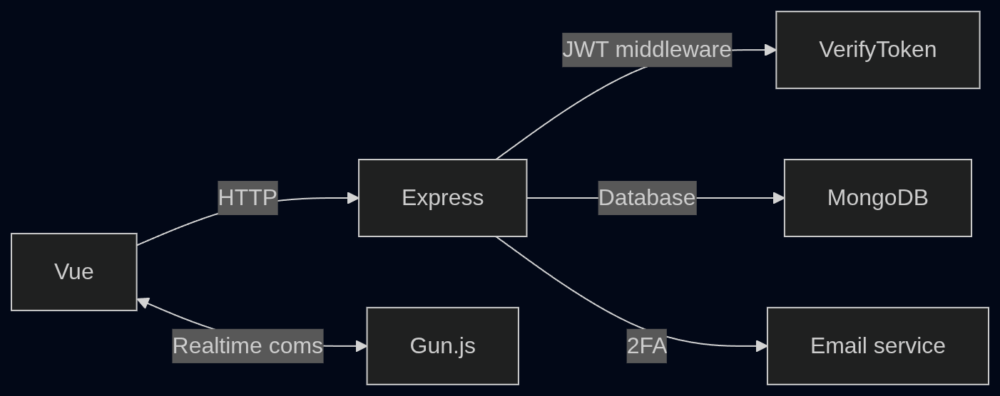
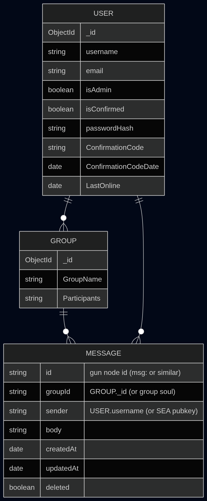

# Live Chat Fullstack Webapp


## Description: 
Fullstack Webapp for users to be able to have a real time communication using a websocket (GUNjs), a frontend and backend framework.  

Users should be able to:   
- Create/Delete and Login into an account  
- Reset the account password  
- Create/Delete Groups with other users  
- Users should be able to Edit the group name  
- If they are an Admin Delete messages  
- Users should be able to edit their messages  


# How to run:
After cloning:  
To make sure everything is installed :``` npm install ```  
To build the project: ``` npm run build ```  
To run the project: ``` npm start ``` or ``` node /server/app.js ```  
To run the tests: ```npm test ```
To run the E2E tests: ```npm run test:e2e ``` while already running a server


# Environmental variables:
In the .env file you should have:  
- ``` PORT = ...``` -> The Port the server is running on  
- ``` MONGO_URI = ...``` -> The URI to connect the server to the mongodb database
- ``` JWT_KEY = ...``` -> The JsonWebToken key to create a token
- ``` EMAIL_PASS = ...``` -> The password for th email
- ``` EMAIL_USER = ...``` -> The email adress


# Deployment:
this project is deployed at https://livechat-qx1k.onrender.com/  
it uses [render](https://render.com/)  

## Authentication & Credentials:
The app requires an email for the verification codes


## Toolkit
### Live Communication:
The live communication will be handled by [GUNjs](https://gun.eco/)

### Backend:
Express for the backend  
Backend Routing and handling of the credentials, database conections

### Frontend:
Vue3 as a frontend framework

### Database:
MongoDB for stroign user data and group data
GUNjs for the messages

### Authentication:
This project uses JWT to ...

## Convention and choices made:
Variables:```PascalCase```
Function: ```PascalCase```

All Functions in their seperate file, imported in the app.js file.  
Automatic tests:   

### Testing:
The project uses the jest and supertest libraries to run tests  

## Architecture diagram:


---
# Modules:
## SE_06(No SQL Databases):
Project uses 2 NoSQL Databases:  
1. GUNjs -> messages
2. MongoDB -> User data and Group Data




---
## SE_08: Clean Code

---
## SE_09(Cyber security):
### Threat model analysis:
Using the `STRIDE` threat model:  
1. Spoofin Identity  
An attacker could Spoof someone Identity login in as another User   
They could Brute Force into soemones account  
Could make up a fake JWT token  

2. Tampering With Data  
Could Delete another Users Data  
Modify Group particiants  
NOSQL Injections  

3. Repudiation  
Attacker Could deny doing anything(NEEDS IMPROVEMENT)  


4. Information Disclosure  
Attacker could try to get passwords in the DB  
Could expose the JWT Key  
Could try to access to users email  
Could see messages in groups even if not a participant  
Can see error messages sent to Client (NEEDS IMPROVEMENT)  


5. Denial Of Service  
Attacker could use bots to spam the /login and /register endpoints  
If logged in they could spam messages to saturate the connection  

6. Elevation Of Privilege  
An Attacker could access messages in other users group  
Modify JWT token to gain admin status  
Access protected routes without a token  
---
## SE_10: Automated Software Testing
Thsi project has several tests:
Integration tests:  
1. Login tests
2. Registration tests
3. Group creation tests
Unit tests:  
1. VerifyToken tests

End-to-End tests:
1. E2E for the login form

---
# file structure:

Livechat/  
├── README.md  
├── package.json  
├── package-lock.json  
├── webpack.config.js  
├── .gitignore  
├── .env  
├── src/  
│   ├── components/  
│   │   ├── Home.vue  
│   │   └── *.vue  
│   ├── pages/  
│   │   ├── home.js  
│   │   └── *.js files  
│   ├── styles/  
│   │   ├── style.css  
│   │   └── *.css files  
│   ├── styles/  
│   │   ├── icon.png  
│   │   └── *.png files   
├── public/  
│   ├── index.html  
│   └── *.html  
├── dist/  
│   └── Build output  
├── server/  
│   ├── app.js  
│   ├── middleware  
│   │   ├── logger.js  
│   │   └── *.js files    
│   ├── models  
│   │   ├── user.js  
│   │   └── *.js files  
│   ├──tests  
│   │   ├── login.test.js  
│   │   └── *.test.js files
│   ├──routes  
│   │   ├── auth.js  
│   │   └── *.js files
│   ├──service  
│   │   ├── email.js  
│   │   └── *.js files
